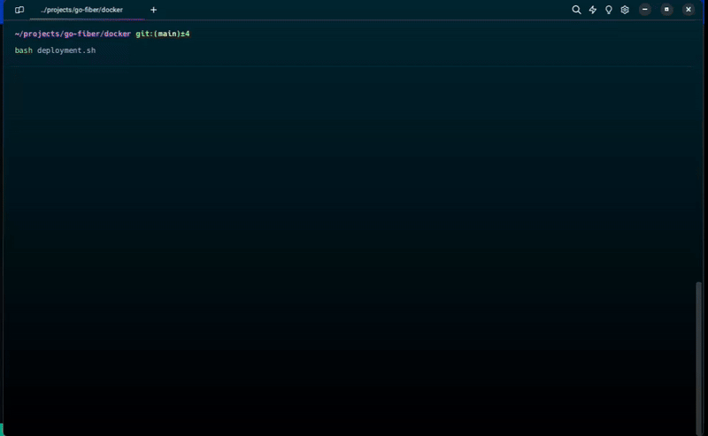

<a href="README.md">
  
</a>

# Go fiber API 🔄

<div>
  <a href="https://go.dev/" target="_blank">
    
  </a>
  <a href="https://gofiber.io/" target="_blank">
    
  </a>
</div>

### Requisitos previos 📝

- Docker Compose **versión 2.x**
- Ejecutar bash desde la carpeta **docker**

#### Puertos habilitados

- [**3000**](http://localhost:3000/docs) para desarrollo
- [**4000**](http://localhost:4000/docs) para producción

#### Menu de opciones 📋

```bash
$ bash deployment.sh
```

```bash
====================
 Go Fiber deployment
====================
1) Deploy on development mode 🛠
2) Delete on development mode 🗑️
3) Deploy on production mode 🚀
4) Delete on production mode 🗑️
5) Quit 👋
Select an option and press Enter 👆:
```

### Demo 🎬



## Información relevante 📑

### Imagen

```bash
$ docker images
```

| REPOSITORY | TAG             | SIZE   |
| ---------- | --------------- | ------ |
| golang     | 1.22-alpine3.19 | 230MB  |
| go-fiber   | 1.0.0           | ~255MB |

### Contenedor

```bash
$ docker ps
```

| NAME          | PORTS                  |
| ------------- | ---------------------- |
| go-fiber      | 0.0.0.0:3000->3000/tcp |
| go-fiber-prod | 0.0.0.0:4000->4000/tcp |
